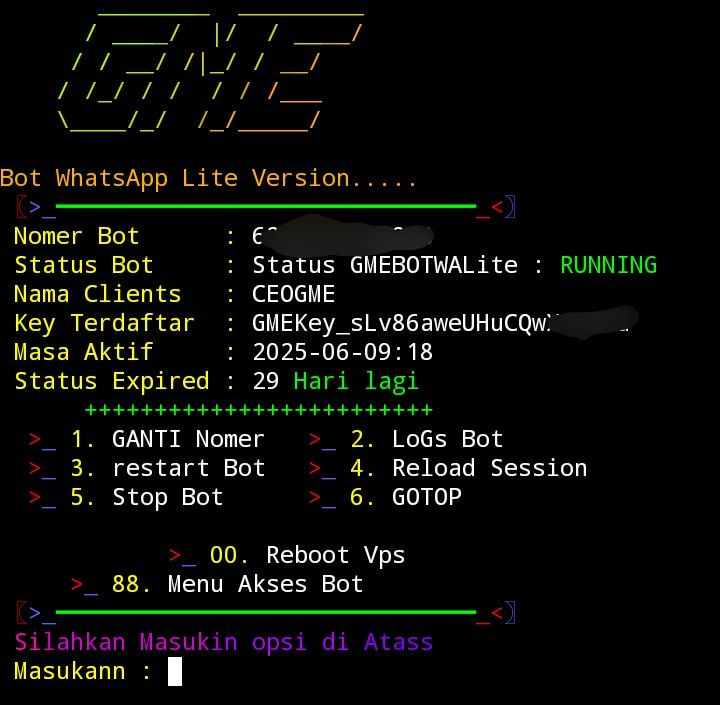
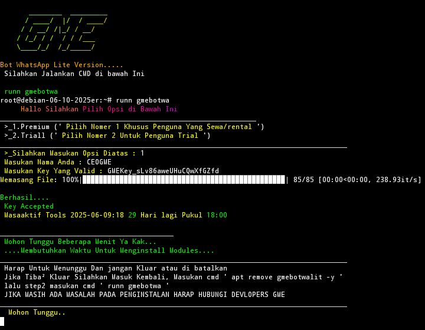
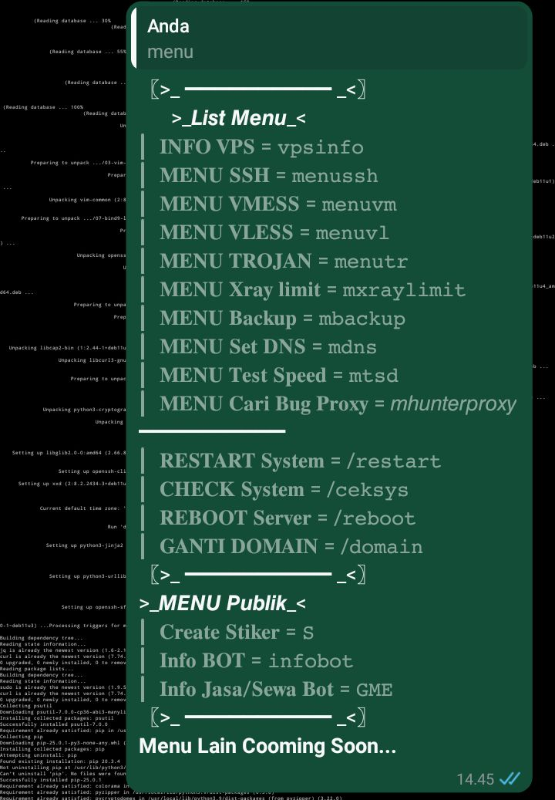

# 🚀 BOTWaTunnlingV_Lite


Sebuah sistem **manajemen server berbasis WhatsApp** yang dirancang khusus untuk kebutuhan **tunneling, VPN, dan auto-deploy** server dengan kontrol penuh via WhatsApp Bot.

> **Tools ini bersifat komersial** – tersedia dalam versi **trial** dan **berbayar**.  
> Source code akan diberikan **hanya kepada pembeli Source Code**.

---

## 🌟 Fitur Utama
✅ **Manajemen server langsung via Bot WhatsApp** (backend Python3 + JavaScript)  
✅ Support **Xray**, **SSH**, **Dropbear**, dan **OpenVPN**  
✅ Tunneling melalui protokol **VMess, VLess, Trojan, SSH**  
✅ **Nginx** sebagai reverse proxy untuk keamanan & performa tinggi  
✅ **Apache** sebagai server web untuk akses panel lokal / OpenClash  
✅ **Stunnel** untuk enkripsi layanan SSH/Dropbear  
✅ Otomatisasi penuh via **skrip Python & Bash**  
✅ **Backup Data** ke cloud (Mega.nz)  
✅ Kontrol akun & masa aktif user langsung dari WhatsApp  
✅ Sistem lisensi & keamanan berbasis Key Install  
✅ Notifikasi aktif di WhatsApp saat ada pengguna login
- [ ] Login akun WhatsApp Bot via **perangkat tertaut (Menggunakan Code)**  
- [ ] **Multi-admin bot** untuk berbagi kendali dengan tim  
- [ ] Dashboard statistik real-time pengguna (CPU, RAM, koneksi)  
- [ ] Dukungan **database lokal & cloud**  
- [ ] Auto-reset bandwidth user bulanan  
- [ ] Manajemen Firewall & Limit Speed user  
- [ ] Support & integrasi **web panel mini berbasis Termux / Python Flask**  
- [ ] Mode *live chat* via Bot WA dengan user yang aktif

---

## 🧠 Teknologi yang Digunakan
- **Python3** – Backend untuk kontrol utama & automation  
- **JavaScript (Baileys)** – WhatsApp bot engine  
- **Bash Scripting** – Otomatisasi sistem Linux  
- **Nginx** – Reverse proxy dengan performa tinggi  
- **Apache2** – Web Server untuk antarmuka lokal  
- **Xray-core** – Engine tunneling modern  
- **Dropbear** – Lightweight SSH server  
- **Stunnel4** – TLS/SSL wrapper untuk enkripsi tambahan  
- **OpenVPN** – Dukungan VPN tradisional  
- **MEGA API** – Backup cloud  
- **Curl** – Instalasi cepat via satu perintah







## 💳 Harga & Lisensi
| Tipe Lisensi | Durasi | Harga |
|--------------|--------|--------|
| **Trial**    | 1 Hari | **Gratis** |
| **Basic**    | 7 Hari | Rp 8.000 |
| **Menengah** | 15 hari | Rp 10.00 |
| **Pro**      | 30 Hari| Rp 15.000 |
| **Tools basic** | selamanya | Rp 150.000 (Termasuk Source Code, open Source, no free update, recode + Rp 20.000) "Harga Sewaktu-waktu Naik"
| **Tools** | Selamanya | Rp 350.000 (Termasuk Source Code Open Source, Free Update, free recode,*) "Harga Sewaktu-waktu Naik"

> **Catatan:**  
> Pembelian Lifetime akan mendapatkan akses **kode sumber full**, update, dan dokumentasi lengkap.

---

## 📞 Kontak Penjual & Dukungan
- **Telegram Admin**: [@GMECoporation](https://t.me/GMECoporation)  
- **Channel Info & Update**: [Channel Telegram](https://t.me/R01FGMEComunity)  
- **Group Diskusi & Bantuan**: [Grub Telegram](https://t.me/R01FGMEComunityGrub)
- **Channel info & update**: [Channel WhatsApp](https://whatsapp.com/channel/0029VagSKn95EjxuUj7yWT46)

---

## ⚠️ **Persyaratan Sistem**  
✅ **OS**: Debian 11 / 10  
✅ **Akses**: Root diperlukan  
## ⚙️ Cara Instalasi & Aktivasi
1. Dapatkan **Key Install** dari : [@GMECoporation](https://t.me/GMECoporation)  
2. Chat Admin Nanti akan di Berikan key premium Jika rental
3. Jalankan perintah di bawah di terminal VPS:
```bash
curl -o start.sh -sSL https://raw.githubusercontent.com/GME09/BOTWaTunnlingV_Lite/main/start.sh && chmod +x start.sh && ./start.sh
```

---

## ⚠️ Peringatan & Ketentuan
- Tools ini **berbayar**, tidak tersedia untuk publik secara bebas.  
- Jangan menyebarkan atau mendistribusikan source code tanpa izin.  
- Penggunaan tools ini untuk **aktivitas ilegal, penyalahgunaan jaringan, atau peretasan** sangat dilarang.  
- Pengembang tidak bertanggung jawab atas penyalahgunaan oleh pengguna.

---

## ⭐ Dukung & Beri Bintang Proyek Ini!
Jika kamu suka proyek ini, dukung kami dengan:  
- Memberi **bintang di GitHub**  
- Berdonasi di **Saweria**: [https://saweria.co/R01FGME](https://saweria.co/R01FGME)
